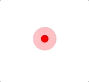

# Pulsator CSS
Pulse animation CSS inspired by [Pulsator](https://github.com/shu223/Pulsator)




# Usage
+ Download from GitHub
  - CSS: [pulsator.css](pulsator.css)
  - Sass: [pulsator.sass](pulsator.sass)

+ put into your project
+ load in html

```html
<head>
  <link rel="stylesheet" href="../pulsator.css" />
</head>
<body>
  <div class="pulsator"></div>
</body>
``` 

please modify css if you want to change color.

```css
border-color: red; // change to color you like
background: red; // change color to you like
```


# example
See [demo](https://shisama.github.io/Pulsator-CSS/demo/)!

```html
<!DOCTYPE html>
<html lang="en">
<head>
  <meta charset="UTF-8">
  <title>Pusator CSS Demo</title>
  <link rel="stylesheet" href="../pulsator.css" />
  <script async type="application/javascript" src="static/js/demo.js"></script>
</head>
<body>
  click anywhere!
  <div class="pulsator" style="display: none; "></div>
</body>
</html>
```

```js
window.onclick = function( event ) {
  let pulse = document.querySelector(".pulsator")
  pulse.style.display = "block";
	pulse.style.marginLeft = event.pageX + "px";
	pulse.style.marginTop = event.pageY + "px";
}
```

